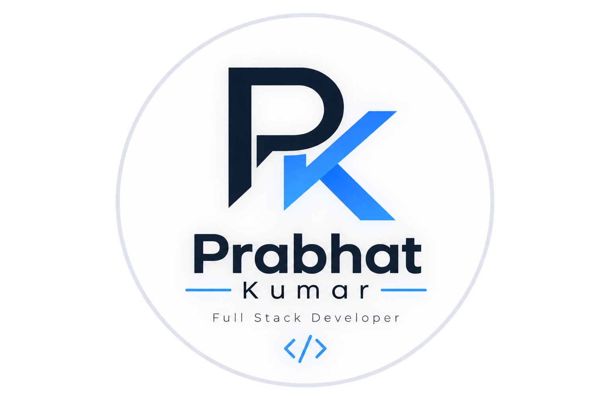

  

<h1 align="center">Hi, I'm Prabhat Kumar 👋</h1>

  <strong>Full Stack Developer | React.js | Node.js | Express.js | MongoDB</strong>

  I build real-world web applications with a focus on clean user experiences,
  reliable backend systems, REST APIs, and scalable business workflows.

  <a href="https://prabhat-portfolio-lake.vercel.app/">Portfolio</a> •
  <a href="https://www.linkedin.com/in/prabhat-kumar-4b120326b/">LinkedIn</a> •
  <a href="https://github.com/Prabhat1615">GitHub</a>

---

---

## 👨‍💻 About Me

- 💻 Full Stack Developer focused on JavaScript and MERN
- ⚛️ Building modern web applications with React.js
- ⚙️ Developing backend services with Node.js and Express.js
- 🗄️ Working with MongoDB, MySQL and PostgreSQL
- 🔐 Implementing authentication, authorization and secure APIs
- 🌐 Building RESTful APIs and full-stack applications
- 🚀 Interested in scalable backend systems and real-world problems
- 📚 Continuously improving my software engineering and problem-solving skills

---

## 🛠️ Tech Stack

### Languages

`JavaScript` `Java` `Python` `HTML5` `CSS3`

### Frontend

`React.js` `Redux` `Tailwind CSS`

### Backend

`Node.js` `Express.js` `REST APIs` `JWT Authentication`

### Databases

`MongoDB` `MySQL` `PostgreSQL`

### Tools & Platforms

`Git` `GitHub` `VS Code` `Postman` `Vercel` `Render`

---

## 🚀 Featured Projects

### 🏪 Uday Electrical Works

A full-stack business management and e-commerce platform designed for an electrical retail and service business.

**Key Features**

- Product catalogue
- Inventory management
- Customer management
- Service bookings
- Technician scheduling
- Billing and order management
- Admin dashboard
- Responsive interface

**Tech:** React.js • Node.js • Express.js • MongoDB

[View Repository →](https://github.com/Prabhat1615/uday-electrical-works)

---

### 📚 StudyNotion

A full-stack online learning platform with authentication, course management, user workflows, and learning features.

**Tech:** React.js • Redux • Node.js • Express.js • MongoDB

[View Repository →](https://github.com/Prabhat1615/StudyNotion)

[Visit Live Application →](https://studynotion-edtech-project-main-gules.vercel.app/)

---

### 🍴 Zayka Food Delivery

A full-stack food delivery platform focused on restaurant, menu, ordering, and customer workflows.

**Tech:** React.js • Node.js • Express.js • MongoDB

[View Repository →](https://github.com/Prabhat1615/Zayka_Food_Delivery)

---

### 💬 Real-Time Chat App

A real-time chat application focused on instant communication and live messaging between users.

**Key Features**

- Real-time messaging
- Live communication
- Responsive chat interface
- Client-server communication
- Real-time event handling

**Tech:** React.js • Node.js • Express.js • Socket.IO

[View Repository →](https://github.com/Prabhat1615/realtime-chat-app)

[Visit Live Application →](https://realtime-chat-app-seven-delta.vercel.app/)

---

### 💼 Developer Portfolio

My personal developer portfolio showcasing my projects, technical skills, experience, and development work.

**Tech:** React.js • JavaScript • HTML • CSS

[View Repository →](https://github.com/Prabhat1615/portfolio)

[Visit Live Portfolio →](https://prabhat-portfolio-lake.vercel.app/)

---
## 🧩 What I Build

| Area | Technologies |
|---|---|
| Frontend | React.js • Redux • Tailwind CSS |
| Backend | Node.js • Express.js |
| APIs | REST APIs • Authentication |
| Security | JWT • Authorization |
| Databases | MongoDB • MySQL • PostgreSQL |
| Deployment | Vercel • Render |
| Development | Git • GitHub • VS Code • Postman |

---
## 🎯 Current Focus

- Building production-ready full-stack applications
- Improving backend architecture and API design
- Writing clean and maintainable JavaScript
- Learning scalable system design
- Improving database design and query performance
- Building secure authentication and authorization systems
- Developing real-world business applications
- Strengthening software engineering and problem-solving skills

---

## 💼 What I'm Looking For

I'm interested in opportunities where I can contribute to real-world software products, work with experienced engineering teams, and continue growing as a Full Stack / Backend Developer.

### Interested In

- Full Stack Development
- Backend Development
- Node.js & Express.js
- REST API Development
- MERN Stack Applications
- Database-driven Applications
- Software Engineering

---

## 🤝 Connect With Me

  <a href="https://prabhat-portfolio-lake.vercel.app/">Portfolio</a> •
  <a href="https://www.linkedin.com/in/prabhat-kumar-4b120326b/">LinkedIn</a> •
  <a href="https://github.com/Prabhat1615">GitHub</a>

---

## ⭐ Thanks for Visiting

Thanks for taking the time to explore my GitHub profile.

Feel free to explore my repositories and projects.

**Let's build something meaningful. 🚀**
